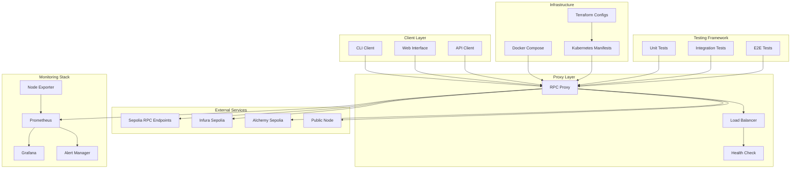

# Ethereum Node Infrastructure Architecture

## System Overview

This document describes the architecture of the Ethereum Sepolia testnet node infrastructure, following the principles outlined in the Senior DevOps Engineer Technical Assessment.

## Architecture Diagram

@startuml
!define C4P https://raw.githubusercontent.com/plantuml-stdlib/C4-PlantUML/master
!includeurl C4P/C4_Context.puml
!includeurl C4P/C4_Container.puml

LAYOUT_WITH_LEGEND()

Person(dev, "DevOps Engineer", "Deploys and maintains the infrastructure")
Person(user, "User", "Interacts with the Ethereum node via RPC")
System_Boundary(s1, "Ethereum Node Infrastructure") {
  Container(proxy, "RPC Proxy", "Python", "Forwards JSON-RPC requests to external Sepolia RPC endpoints")
  Container(monitor, "Monitoring Stack", "Prometheus, Grafana, Alertmanager", "Collects and visualizes metrics, sends alerts")
  Container(compose, "Orchestration", "Docker Compose / Kubernetes", "Automates deployment and lifecycle management")
  Container(test, "Test Suite", "pytest", "Integration and functional tests")
}
System_Ext(sepolia, "Sepolia RPC Providers", "Infura, PublicNode, Alchemy, etc.")

Rel(user, proxy, "JSON-RPC requests")
Rel(dev, compose, "CI/CD, IaC, management")
Rel(proxy, sepolia, "Forwards requests to Sepolia RPC endpoints")
Rel(proxy, monitor, "Exports metrics")
Rel(monitor, dev, "Dashboards, alerts")
Rel(compose, proxy, "Deploys and manages lifecycle")
Rel(test, proxy, "Tests RPC API")
@enduml

### Full Details Diagram 

@startuml
!define C4P https://raw.githubusercontent.com/plantuml-stdlib/C4-PlantUML/master
!includeurl C4P/C4_Context.puml
!includeurl C4P/C4_Container.puml
!includeurl C4P/C4_Component.puml

LAYOUT_WITH_LEGEND()

Person(dev, "DevOps Engineer", "Deploys and maintains the infrastructure")
Person(user, "User", "Interacts with the Ethereum node via RPC")
Person(admin, "Cluster Admin", "Manages Kubernetes cluster and GitOps")

System_Boundary(s1, "Ethereum Node Infrastructure") {
  Container(proxy, "RPC Proxy", "Python", "Forwards JSON-RPC requests to external Sepolia RPC endpoints")
  Container(monitor, "Monitoring Stack", "Prometheus, Grafana, Alertmanager", "Collects and visualizes metrics, sends alerts")
  Container(compose, "Orchestration", "Docker Compose / Kubernetes", "Automates deployment and lifecycle management")
  Container(test, "Test Suite", "pytest", "Integration and functional tests")
  
  Container_Boundary(k8s, "Kubernetes Cluster") {
    Container(statefulset, "Ethereum StatefulSet", "Geth v1.13.0", "3 replicas of Ethereum nodes with persistent storage")
    Container(hpa, "Horizontal Pod Autoscaler", "Kubernetes HPA", "Scales pods based on CPU/Memory usage (3-5 replicas)")
    Container(vpa, "Vertical Pod Autoscaler", "Kubernetes VPA", "Optimizes resource requests and limits")
    Container(ingress, "Ingress Controller", "GKE Load Balancer", "External access and SSL termination")
    Container(certmanager, "Cert-Manager", "cert-manager", "Automated SSL certificate management")
    Container(sealedsecrets, "Sealed Secrets", "Bitnami Sealed Secrets", "Encrypted secrets management")
    Container(storage, "Persistent Storage", "pd-ssd StorageClass", "32Gi SSD storage per replica")
    Container(networkpolicy, "Network Policy", "Kubernetes NetworkPolicy", "Traffic control and security")
  }
  
  Container_Boundary(gitops, "GitOps Infrastructure") {
    Container(kustomize, "Kustomize", "kustomize", "Manifests customization and overlays")
    Container(flux, "Flux CD", "Flux", "GitOps continuous deployment")
    Container(terraform, "Terraform", "Terraform", "Infrastructure as Code for GCP resources")
  }
}

System_Ext(sepolia, "Sepolia RPC Providers", "Infura, PublicNode, Alchemy, etc.")
System_Ext(gcp, "Google Cloud Platform", "GKE, Cloud Storage, Load Balancer")
System_Ext(git, "Git Repository", "Source code and manifests version control")

Rel(user, ingress, "HTTPS requests")
Rel(admin, git, "Manages manifests and configuration")
Rel(dev, terraform, "Deploys infrastructure")
Rel(flux, git, "Watches for changes")
Rel(flux, k8s, "Applies manifests")
Rel(terraform, gcp, "Creates GKE cluster and resources")

Rel(ingress, statefulset, "Routes traffic")
Rel(statefulset, storage, "Uses persistent volumes")
Rel(hpa, statefulset, "Scales replicas")
Rel(vpa, statefulset, "Optimizes resources")
Rel(certmanager, ingress, "Provides SSL certificates")
Rel(sealedsecrets, statefulset, "Provides encrypted secrets")
Rel(networkpolicy, statefulset, "Controls network access")

Rel(proxy, sepolia, "Forwards requests to Sepolia RPC endpoints")
Rel(proxy, monitor, "Exports metrics")
Rel(monitor, dev, "Dashboards, alerts")
Rel(compose, proxy, "Deploys and manages lifecycle")
Rel(test, proxy, "Tests RPC API")

Rel(statefulset, sepolia, "Syncs with Sepolia network")
Rel(statefulset, monitor, "Exports node metrics")
Rel(monitor, admin, "Cluster monitoring and alerts")
@enduml

### And some other



## Component Details

### 1. RPC Proxy Layer
- **Purpose**: Provides a unified interface to external Sepolia RPC endpoints
- **Features**: 
  - Request forwarding with retry logic
  - Load balancing across multiple endpoints
  - Health checks and failover
  - CORS support
  - Metrics collection

### 2. External RPC Endpoints
- **Primary**: `https://ethereum-sepolia.publicnode.com`
- **Fallbacks**: Infura, Alchemy, rpc.sepolia.org
- **Strategy**: Automatic rotation on failure

### 3. Monitoring Stack
- **Prometheus**: Metrics collection and storage
- **Grafana**: Visualization and dashboards
- **Alert Manager**: Alerting and notification
- **Node Exporter**: System metrics

### 4. Infrastructure as Code
- **Docker Compose**: Local development and testing
- **Kubernetes**: Production deployment
- **Terraform**: Cloud infrastructure provisioning

### 5. Testing Framework
- **Unit Tests**: Individual component testing
- **Integration Tests**: End-to-end functionality testing
- **E2E Tests**: Complete workflow validation

## Data Flow

1. **Request Flow**:
   ```
   Client → RPC Proxy → External RPC → Response → Client
   ```

2. **Monitoring Flow**:
   ```
   RPC Proxy → Prometheus → Grafana → Alert Manager
   ```

3. **Health Check Flow**:
   ```
   Health Check → RPC Proxy → External RPC → Status
   ```

## Security Considerations

### Network Security
- CORS headers configured for web access
- Request validation and sanitization
- Rate limiting (implemented in proxy)
- TLS termination at load balancer

### Access Control
- No authentication required for read-only operations
- Environment variable configuration
- Secrets management through Docker/K8s

### Monitoring Security
- Prometheus metrics endpoint protected
- Grafana authentication enabled
- Alert notifications secured

## Scalability Design

### Horizontal Scaling
- Multiple RPC proxy instances behind load balancer
- Kubernetes horizontal pod autoscaler
- Stateless proxy design

### Vertical Scaling
- Resource limits and requests configured
- CPU and memory monitoring
- Auto-scaling based on metrics

### Load Distribution
- Round-robin load balancing
- Health check-based endpoint selection
- Automatic failover

## Reliability Features

### High Availability
- Multiple external RPC endpoints
- Automatic failover and retry
- Health checks and monitoring
- Graceful degradation

### Backup and Recovery
- Configuration version control
- Docker image backups
- Monitoring data retention
- Disaster recovery procedures

### Error Handling
- Comprehensive error logging
- Retry mechanisms with exponential backoff
- Circuit breaker pattern for external services
- Graceful error responses

## Performance Optimization

### Response Time
- Connection pooling
- Request caching (where applicable)
- Optimized JSON parsing
- Efficient error handling

### Resource Utilization
- Memory-efficient proxy implementation
- CPU usage monitoring
- Network bandwidth optimization
- Storage optimization

### Monitoring Metrics
- Request latency (p50, p95, p99)
- Error rates and types
- Throughput (requests/second)
- Resource utilization

## Deployment Strategies

### Local Development
```bash
docker-compose up -d
```

### Production Deployment k8s
```bash
# Terraform
terraform init
terraform plan
terraform apply

# Kubernetes
Read k8s/README and setup

kubectl apply -f k8s/
```

### Blue-Green Deployment
- Zero-downtime deployments
- Health check validation
- Automatic rollback on failure

## Compliance and Standards

### Ethereum Standards
- JSON-RPC 2.0 compliance
- Sepolia testnet compatibility
- Standard Ethereum API methods

### DevOps Best Practices
- Infrastructure as Code
- Automated testing
- Continuous monitoring
- Version control
- Documentation

### Security Standards
- OWASP guidelines
- Container security best practices
- Network security policies
- Access control principles

## Future Enhancements

### Planned Improvements
1. **Authentication**: JWT-based authentication
2. **Caching**: Redis-based response caching
3. **Rate Limiting**: Advanced rate limiting per client
4. **Analytics**: Request analytics and insights
5. **Multi-chain**: Support for other testnets

### Scalability Roadmap
1. **Microservices**: Break down into smaller services
2. **Service Mesh**: Implement Istio for advanced routing
3. **Event Streaming**: Kafka for event processing
4. **Machine Learning**: Predictive scaling and optimization

## Conclusion

This architecture provides a robust, scalable, and maintainable solution for Ethereum Sepolia testnet node infrastructure. It follows DevOps best practices, implements comprehensive monitoring, and ensures high availability and reliability.

The design is production-ready and can be easily adapted for other Ethereum networks or blockchain platforms. 